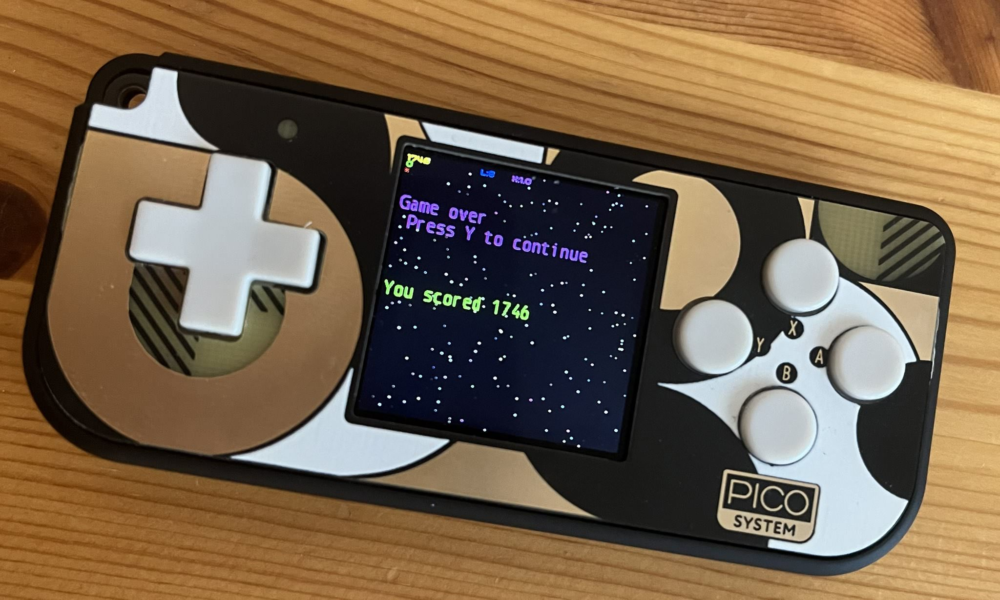

# roids

An Asteroids clone for the [Pimoroni PicoSystem](https://shop.pimoroni.com/products/picosystem?variant=32369546985555), based on the visuals of [Hyperoid by Edward Hutchins](https://www.mobygames.com/game/12949/hyperoid/).

Uses the [blit32 engine](https://github.com/32blit/32blit-sdk), and thus can be built for the pico, web (using emscripten) and Mac/Linux.

If you want to play on the web or download the `.uf2` for the PicoSystem, head to [itch.io](https://rberenguel.itch.io/roids).

Thanks `rn` for all the help with C++. Anything that looks wonky is because I didn't ask or ignored his advice.

## How it looks and plays

Here is a short video of gameplay with the Mac build. The web version looks pretty much the same, and the Pico version is just a portable, really small one. You can see a picture of the endgame screen below the video.

VIDEO

## Building locally

Follow the instructions of the [blit32 SDK](https://github.com/32blit/32blit-sdk) depending on your target platform. Blit32 supports web, Mac, Linux, Windows. The Pico instructions are [here](https://github.com/32blit/32blit-sdk/blob/master/docs/pico.md).

The TL;DR of all the options will be something like:

- Install the Python libraries used as helpers during `cmake`, and if using a virtual environment, go into it.
- Configure the path (or settings to always download) the Pico SDK, if building for the Pico.
- Create a build folder and go into it.
- `cmake ..` This only needs to be done pretty much once if the cmake config does not change. For emscripten, it will be with `emcmake`.
- `make -j 8` with some additional flags depending on the target.

